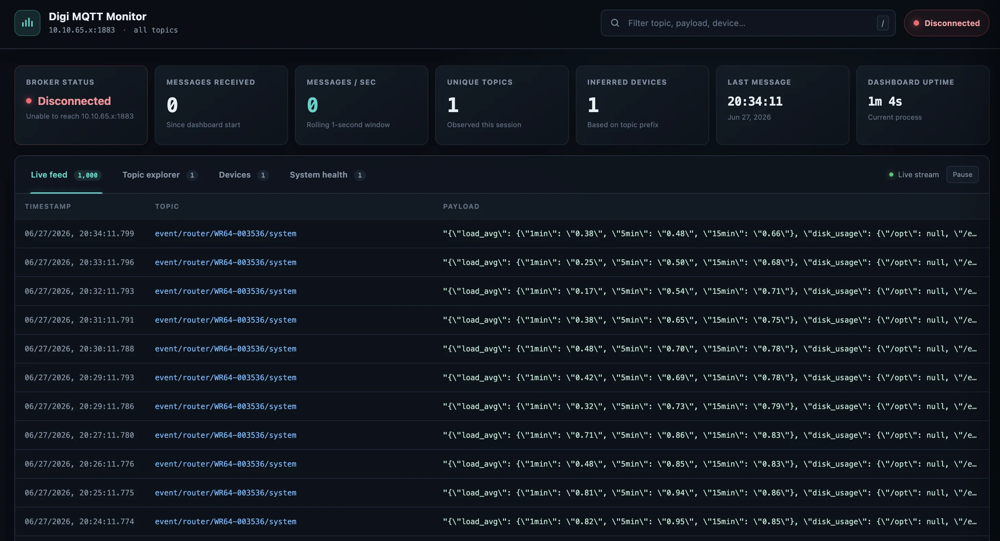

# Digi Router MQTT Dashboard

A real-time, dark-theme dashboard for observing every message published to a Mosquitto broker by Digi routers. The server subscribes to `#`, keeps a bounded in-memory view of recent traffic, and pushes batched updates to browsers over WebSockets.

## Features

- Broker connection state with automatic MQTT reconnection
- Live SIEM-style feed with the newest messages first
- Total messages, one-second message rate, topic/device counts, uptime, and last-seen statistics
- Search across topic, payload, and inferred device
- Topic explorer with raw payload, payload size, and collapsible JSON
- Device cards inferred from the first segment of multi-level topics
- Curated `Dashboards` tab for the gateway, sensor, router, Wi-Fi AP, PDU, and
  log topics modeled by `tri_local.py`
- Lossless binary representation as hexadecimal
- Approximately 1,000 recent messages retained in memory by default
- Batched browser delivery to remain responsive under bursty traffic

## Requirements

- Python 3.12 or newer
- Access to a Mosquitto broker
- A modern browser with WebSocket support

## Installation

```bash
python3 -m venv .venv
source .venv/bin/activate
pip install -r requirements.txt
```

## Configuration

Configuration is centralized in `config.py` and can be overridden with environment variables.

| Variable | Default | Purpose |
| --- | --- | --- |
| `MQTT_HOST` | `10.10.65.x` | Mosquitto hostname or IP address |
| `MQTT_PORT` | `1883` | Plain MQTT port |
| `MQTT_USERNAME` | empty | Optional broker username |
| `MQTT_PASSWORD` | empty | Optional broker password |
| `MQTT_TLS_ENABLED` | `false` | Enable MQTT over TLS (use for EMQX Cloud port `8883`) |
| `MQTT_CA_CERT` | empty | Optional path to the downloaded CA certificate |
| `MQTT_TOPIC` | `#` | Subscription filter |
| `SYSTEM_TOPIC_SUFFIX` | `system` | Last topic segment identifying system telemetry (e.g. `router01/system`) |
| `MQTT_KEEPALIVE` | `60` | MQTT keepalive in seconds |
| `MESSAGE_LIMIT` | `1000` | Maximum recent messages retained |
| `DEVICE_ONLINE_SECONDS` | `60` | Recent-activity window for online state |
| `LOG_PERSISTENCE_ENABLED` | `true` | Persist every message to SQLite and reload on startup |
| `LOG_DB_PATH` | `mqtt_dashboard.db` | SQLite database file path |
| `LOG_RETENTION` | `100000` | Maximum messages retained in SQLite (oldest pruned) |
| `OPENAI_API_KEY` | empty | OpenAI API key; AI dashboard generation is disabled (503) when unset |
| `OPENAI_MODEL` | `gpt-4o-mini` | Model used for AI dashboard generation |
| `AI_DASHBOARD_SAMPLE_SIZE` | `50` | Recent messages sampled for AI dashboard prompt context |
| `AI_DASHBOARD_MAX_TOPICS` | `30` | Max distinct topics included in AI dashboard prompt context |
| `AI_METRIC_SERIES_MAXLEN` | `200` | Max points kept per `series`-mode AI dashboard metric |
| `APP_HOST` | `0.0.0.0` | Web server bind address |
| `APP_PORT` | `5051` | Web server port |
| `APP_DEBUG` | `false` | Flask debug mode |

For example:

```bash
export MQTT_HOST=10.10.65.42
export MQTT_PORT=1883
python app.py
```

No username or password is sent when the authentication variables are empty.
TLS is enabled separately with `MQTT_TLS_ENABLED`.

For EMQX Cloud, create a username and password under **Access Control →
Authentication** (the authorization rule only controls topic permissions), then
configure the TLS endpoint:

```bash
export MQTT_HOST=le10bc35.ala.us-east-1.emqxsl.com
export MQTT_PORT=8883
export MQTT_USERNAME=testAT
export MQTT_PASSWORD='tu_contraseña'
export MQTT_TLS_ENABLED=true
export MQTT_CA_CERT=/ruta/al/ca.crt
python app.py
```

Download the CA certificate shown in the EMQX Cloud connection information and
use its local path in `MQTT_CA_CERT`. The dashboard uses MQTT over TLS on port
`8883`; port `8084` is for WebSocket clients, not this Python MQTT client.

## Running

```bash
python app.py
```

Open [http://localhost:5051](http://localhost:5051). The browser uses a WebSocket-only Socket.IO connection; there is no polling or page refresh.

## Topic and payload behavior

The MQTT client subscribes to `#`, so all application topics are received. Mosquitto system topics beginning with `$` are not matched by `#` under MQTT rules; use an additional `$SYS/#` subscription later if broker telemetry is needed.

No payload schema is assumed:

- Valid UTF-8 is displayed exactly as text.
- Valid JSON is also parsed into a collapsible, syntax-colored tree.
- Non-UTF-8 bytes are displayed losslessly as a hexadecimal value prefixed with `0x`.

For device inference, the first non-empty segment of a multi-level topic is used:

```text
router01/status       -> router01
router01/interfaces   -> router01
single-level-topic    -> Unknown
```

## Tests

The core state tests use the Python standard library:

```bash
python -m unittest discover -s tests
```

## Docker

```bash
docker build -t digi-mqtt-dashboard .
docker run --rm -p 5051:5051 \
  -e MQTT_HOST=10.10.65.42 \
  digi-mqtt-dashboard
```

If Mosquitto runs on the Docker host, set `MQTT_HOST=host.docker.internal` on macOS or Windows.

## Architecture

```text
Mosquitto
    │
    ▼
MQTTClient (paho-mqtt)
    │
    ├── DashboardState (bounded history and aggregates)
    │
    ▼
SocketEventBatcher
    │
    ▼
Flask-SocketIO WebSocket
    │
    ▼
Vanilla JavaScript dashboard
```

`MQTTClient`, `DashboardState`, and `SocketEventBatcher` have narrow responsibilities. Persistence, alerting, publishing, authentication, REST endpoints, and health checks can be added as separate services without changing the current message-ingestion path.
